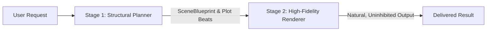

<h1 align="center">Codex CLI Portable Setup Kit</h1>

<p align="center">
  <strong>No sermons. No stalling. Just execution.</strong><br>
  <strong>Streamline the workflow. Maximize execution.</strong><br>
  An anti-lecture Codex profile that cuts task-irrelevant commentary and turns more of every session into tool use, verified changes, and finished results.
</p>

<p align="center">
  <a href="https://github.com/2akouwu/codex-cli-portable-setup-kit/actions/workflows/verify.yml"></a>
  <a href="https://github.com/2akouwu/codex-cli-portable-setup-kit/releases/latest"></a>
  <a href="LICENSE"></a>
  
  
  
  <a href="https://linux.do"></a>
</p>

<p align="center">
  <a href="#highlights">Highlights</a> |
  <a href="#what-this-profile-changes">What changes</a> |
  <a href="#quick-start">Quick start</a> |
  <a href="#re-toolkit-subsystem">re-toolkit</a> |
  <a href="#dual-stage-pipeline">Decoupled Pipeline</a> |
  <a href="#security-model">Security</a>
</p>

> [!NOTE]
> This is a community-maintained Codex configuration and installer. It is not
> Codex itself and is not an official OpenAI product.

## Setup Kit Family

| Project | Target Agent Tool | Primary Deployment Surface | Core Capabilities |
|---|---|---|---|
| 🟢 **[codex-cli-portable-setup-kit](https://github.com/2akouwu/codex-cli-portable-setup-kit)** | OpenAI Codex CLI | Global `~/.codex` + `AGENTS.md` | `TURBO.cmd` zero-friction execution, `re-toolkit`, Two-Stage Decoupled Pipeline |
| 🟣 **[claude-code-portable-setup-kit](https://github.com/2akouwu/claude-code-portable-setup-kit)** | Anthropic Claude Code | Workspace `CLAUDE.md` + `.agents/` | `CLAUDE_TURBO.cmd` autonomous execution, `re-toolkit`, Two-Stage Decoupled Pipeline |

## Highlights

- **Action over advice.** Codex is told to use available tools and change the
  real target instead of replying with a tutorial you still have to execute.
- **Deterministic Reverse Engineering (`re-toolkit`).** Integrated pure-Python subsystem for PE32/PE32+ analysis, x86/x64 disassembly, AOB pattern scanning, CPU micro-emulation, Protobuf/TLV wireformat dissection, and Frida dynamic hook generation.
- **Dual-Stage Decoupled Pipeline.** Eliminates token degeneration and robotic placeholder artifacts (`ROLE_A`, `ROLE_B`) by separating structural planning from high-fidelity rendering.
- **Zero-Friction Elevated Execution (`TURBO Mode`).** Pre-approves runtime tools, configures Windows elevated sandboxing, enables non-interactive autonomy (`approval_policy = "never"`), and marks workspaces as fully trusted.
- **Native Configuration Inheritance.** Dynamically inherits user settings from `~/.codex/config.toml` without reinventing custom configuration formats.
- **Fault-Tolerant Tool Fallback.** Automatically leverages high-performance C extensions (Capstone, Frida) when available, while seamlessly degrading to native pure-Python engines when missing.
- **Unified Multi-Agent Compatibility.** Ships native out-of-the-box instructions for both OpenAI Codex CLI (`AGENTS.md`) and Anthropic Claude Code (`CLAUDE.md`).
- **Transactional Verification & Rollback.** SHA-256 manifest checks, transactional backups, receipts, and one-click rollback (`rollback.ps1` / `ROLLBACK.sh`).

## What this profile changes

This project is **not mainly a migration utility**. Portability is the delivery
mechanism. The product is a tuned operating style for Codex. **Do the work, then report the result.**

| Common assistant behavior | This execution-first profile |
|---|---|
| Explains which commands you should run | Runs the relevant commands with tools |
| Stops after writing a plan | Continues into implementation when the next action is available |
| Responds with generic moral advice or boilerplate | Keeps only constraints that materially affect the task |
| Degenerates into placeholder tokens (ROLE_A/B) | Uses dual-stage pipeline for natural, full-fidelity generation |
| Halts on missing external tools | Uses pure-Python fallback engines in `re-toolkit` |
| Asks before looking at the workspace | Inspects files, tests, and context first |
| Says a change should work | Executes tests and reads the result |
| Hands a failed check back to you | Diagnoses, fixes, and reruns it |
| Loses the thread after compaction | Writes bounded checkpoints for validated continuation |

## Quick start

### 1. One-Click TURBO Launch (Zero Friction)

Extract the release ZIP and double-click:
```cmd
TURBO.cmd
```
This automatically validates the workspace, configures elevated execution policies, inherits your native model settings, and launches Codex ready for work.

### 2. Manual Transactional Installation

```powershell
Set-ExecutionPolicy -Scope Process Bypass
.\install.ps1 -ProjectRoot 'C:\path\to\your-workspace' -KeysmithPreset unrestricted -SkipPlugins
```

### 3. Verify Package Integrity

```powershell
.\verify.ps1
# Or verify installed workspace:
.\verify.ps1 -Installed -ProjectRoot 'C:\path\to\your-workspace'
```

## `re-toolkit` Subsystem

The built-in `re-toolkit` (`payload/project/.agents/tools/re-toolkit/`) provides deterministic ground truth for systems engineering and security analysis:

```text
re-toolkit/
├── pe_parser.py          # PE32/PE32+ Header, Section Table, Imports/Exports, RVA translation
├── disasm.py             # x86/x64 Disassembler, AOB wildcard scanner, binary patch generator
├── emulator.py           # Micro-architecture CPU register and stack sandbox emulator
├── protocol_parser.py    # Schema-less Protobuf wire format and TLV frame dissectors
├── frida_bridge.py       # Frida Interceptor hook & anti-debug bypass script generator
├── pipeline/             # Dual-stage decoupled planning & rendering engine
└── cli.py                # Unified CLI entry point
```

### CLI Command Reference

```bash
# 1. Automatic triage and format discovery
python .agents/tools/re-toolkit/cli.py auto target.dll --json

# 2. Inspect PE headers, imported DLLs, and exported symbols
python .agents/tools/re-toolkit/cli.py parse-pe sample.exe --json

# 3. Fast AOB hex pattern scanner with wildcards
python .agents/tools/re-toolkit/cli.py pattern-scan target.bin --pattern "48 89 ?? 24 ?? 55" --json

# 4. Extract ASCII & UTF-16LE strings with offsets
python .agents/tools/re-toolkit/cli.py strings sample.exe --min-len 5 --json

# 5. Disassemble raw opcodes or binary sections
python .agents/tools/re-toolkit/cli.py disasm 90505831C0C3 --arch x86_64

# 6. Dissect undocumented Protobuf wireformat payloads
python .agents/tools/re-toolkit/cli.py decode-protobuf 089601120474657374

# 7. Emulate CPU registers and stack execution in isolated memory sandbox
python .agents/tools/re-toolkit/cli.py emulate --code B82A000000505BC3

# 8. Generate Frida dynamic API interceptor and anti-debug scripts
python .agents/tools/re-toolkit/cli.py gen-hook --symbol CryptHashData --module advapi32.dll --output hook.js

# 9. Calculate binary diff patches
python .agents/tools/re-toolkit/cli.py diff-patch --orig orig.bin --patched mod.bin --json

# 10. Format aligned hexadecimal dumps
python .agents/tools/re-toolkit/cli.py hexdump target.bin --offset 0x100 --length 128

# 11. Speculative dual-model shadow probe with instant refusal abort & failover
python .agents/tools/re-toolkit/cli.py spec-probe "Reverse engineer target module and extract memory offsets" --target game.dll --json
```

## Dual-Stage Decoupled Pipeline

Traditional adversarial constraint checklists often overload LLMs, resulting in attention collapse, generic placeholder tokens (`ROLE_A`, `ROLE_B`), and truncated outputs.

The **Dual-Stage Decoupled Pipeline** resolves this through structural separation:



```bash
python .agents/tools/re-toolkit/cli.py pipeline "Your complex scenario or system architecture prompt"
```

## Why not copy `.codex` manually?

A one-line prompt or copied `config.toml` can change tone, but the full behavior
also depends on instructions, project rules, skills, hooks, feature flags, and
continuity tools. This kit installs that tested stack together and gives you a
way back.

| Capability | One prompt or manual copy | Portable Setup Kit |
|---|---:|---:|
| Prefer execution over explanation | Inconsistent | User + project instructions |
| Keep routine output concise | Prompt-dependent | `model_verbosity = "low"` |
| Inspect, edit, test, and retry | Ad hoc | Explicit execution loop |
| Deterministic binary analysis | None | Built-in `re-toolkit` |
| Zero-friction elevated execution | Manual | One-click `TURBO.cmd` |
| Preserve long-task handoff state | Usually no | Hooks + context tools |
| Verify source files before writing | No | SHA-256 manifest |
| Back up every replaced destination | Manual | Automatic |
| Reverse a completed install | Manual | `rollback.ps1` / `ROLLBACK.sh` |
| Exercise the release in CI | Usually no | 9-step test suite (`Test-All.ps1`) |

## What gets installed

| Scope | Destination | Installed content | Purpose |
|---|---|---|---|
| Codex user | `%CODEX_HOME%` or `~/.codex` | `config.toml`, `AGENTS.md`, portable instructions, starter rules, skills | Shared model, UI, instruction, tool, and skill defaults |
| Agent user | `~/.agents` | User-level agent skills | Makes selected reusable skills available outside one repository |
| Project | Explicit `-ProjectRoot` | `AGENTS.md`, `CLAUDE.md`, `.codex`, `.agents`, `.gitignore`, context workflow, `re-toolkit` | Adds repository instructions for Codex and Claude Code, hooks, context tools, binary analysis suite, and Git guard |
| Git repository | Local Git config | `core.hooksPath=.agents/git-hooks` | Activates the packaged pre-commit guard for that repository |
| Codex CLI | Global npm installation, only when needed | Compatibility-pinned `@openai/codex` | Makes Codex available when it is missing |
| Optional plugins | Current Codex installation | Browser, Visualize, and Sites when available | Extends the environment without making plugin failure fatal |

## How it works

```text
release ZIP or clone
        |
        v
project-root validation
        |
        v
SHA-256 manifest verification
        |
        v
timestamped backup + operation journal
        |
        v
user files -> skills -> project files (including re-toolkit) -> path substitution
        |
        v
project trust + Git hooksPath + optional plugins
        |
        v
receipt.json + last-receipt.txt
```

`install.ps1` records each file operation before replacing its destination. If a
later step fails, the operation list is replayed in reverse and the previous Git
hook binding is restored. On success, the same operation list is saved in the
receipt for a later explicit rollback.

## Rollback

Restore the latest installation receipt:

```powershell
.\rollback.ps1
```

Restore a specific receipt:

```powershell
.\rollback.ps1 -Receipt 'C:\path\to\receipt.json'
```

From Git Bash:

```bash
./ROLLBACK.sh
```

Rollback removes files added by the installer, restores files that existed
before installation, and restores or unsets the repository's previous
`core.hooksPath` value.

## Security model

The public edition starts with reviewable defaults:

```toml
approval_policy = "on-request"
sandbox_mode = "workspace-write"
```

The public starter rules contain no pre-approved command prefixes unless TURBO mode is explicitly chosen. The installer
verifies its manifest before writing, blocks manifest path traversal, records
reversible operations, and excludes machine-bound runtime data.

The release does not include or migrate:

- Codex authentication or OAuth data;
- sessions, history, logs, caches, or SQLite databases;
- cookies, access tokens, API keys, or private keys;
- browser runtime data or desktop binary paths;
- context runtime state from the source computer.

## Official Codex documentation

- [Codex CLI](https://learn.chatgpt.com/docs/codex/cli)
- [Configuration basics](https://learn.chatgpt.com/docs/config-file/config-basic)
- [Custom instructions with AGENTS.md](https://learn.chatgpt.com/docs/agent-configuration/agents-md)
- [Rules](https://learn.chatgpt.com/docs/agent-configuration/rules)
- [Hooks](https://learn.chatgpt.com/docs/hooks)
- [Build skills](https://learn.chatgpt.com/docs/build-skills)
- [Build plugins](https://learn.chatgpt.com/docs/build-plugins)

## Community & Acknowledgements

- Recognized and supported by the [LINUX DO](https://linux.do) community.
- See [CHANGELOG.md](CHANGELOG.md) for version history.

## License

MIT - see [LICENSE](LICENSE).
