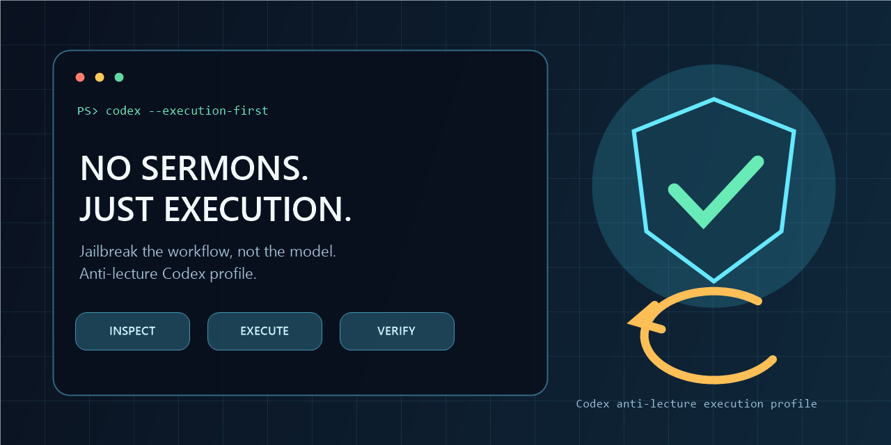

<h1 align="center">Codex CLI Portable Setup Kit</h1>

<p align="center">
  <strong>No sermons. No stalling. Just execution.</strong><br>
  <strong>Jailbreak the workflow, not the model.</strong><br>
  An anti-lecture Codex profile that cuts task-irrelevant commentary and turns more of every session into tool use, verified changes, and finished results.
</p>

<p align="center">
  <a href="https://github.com/2akouwu/codex-cli-portable-setup-kit/actions/workflows/verify.yml"></a>
  <a href="https://github.com/2akouwu/codex-cli-portable-setup-kit/releases/latest"></a>
  <a href="LICENSE"></a>
  
  
</p>

<p align="center">
  <a href="#what-this-profile-changes">What changes</a> |
  <a href="#quick-start">Quick start</a> |
  <a href="docs/EXECUTION_PROFILE.md">How the profile works</a> |
  <a href="#security-model">Security</a> |
  <a href="docs/PROMOTION_PLAYBOOK.md">Launch playbook</a>
</p>



> [!NOTE]
> This is a community-maintained Codex configuration and installer. It is not
> Codex itself and is not an official OpenAI product.

## Highlights

- **Action over advice.** Codex is told to use available tools and change the
  real target instead of replying with a tutorial you still have to execute.
- **Higher execution density.** More of each session goes to inspecting, editing,
  testing, fixing, and finishing instead of generic advice or repeated narration.
- **Investigate before interrupting.** It checks files, tests, history, and local
  context before asking questions that the workspace can answer.
- **Task-relevant communication.** Broad, non-actionable commentary is minimized;
  generic moralizing, repeated caveats, and refusal-style boilerplate are cut when
  they do not change the task. Real constraints stay brief and actionable.
- **Verification before claims.** The profile asks Codex to run the relevant
  checks and read their literal result before saying the work is finished.
- **Long-task continuity.** PostCompact checkpoints, Context Guardian, Codex
  Continuous, and Orchestrator components help unfinished work retain a bounded
  handoff and resume from verified state.
- **Useful tools already connected.** Browser, Visualize, Sites, skills, project
  hooks, and OpenAI documentation support are packaged as one working profile.
- **Safe, reversible delivery.** SHA-256 checks, transactional backups, receipts,
  and tested rollback make the profile practical to install and remove.

## What this profile changes

This project is **not mainly a migration utility**. Portability is the delivery
mechanism. The product is a tuned operating style for Codex. **Do the work, then report the result.**

| Common assistant behavior | This execution-first profile |
|---|---|
| Explains which commands you should run | Runs the relevant commands with tools |
| Stops after writing a plan | Continues into implementation when the next action is available |
| Responds with generic moral advice or boilerplate | Keeps only constraints that materially affect the task |
| Announces every small step | Keeps interim narration brief |
| Asks before looking at the workspace | Inspects files, tests, and context first |
| Says a change should work | Executes tests and reads the result |
| Hands a failed check back to you | Diagnoses, fixes, and reruns it |
| Loses the thread after compaction | Writes bounded checkpoints for validated continuation |

The behavior comes from several layers working together:

1. **High reasoning effort** gives difficult coding and debugging tasks more
   problem-solving budget.
2. **Low response verbosity** reduces routine explanation; it does not reduce
   the configured reasoning effort.
3. **Execution instructions** explicitly prefer tool calls, real edits,
   verification, and continued work over advice, plans, or promises.
4. **Project rules and skills** give Codex repository-specific workflows and
   reusable procedures.
5. **Hooks and continuity tools** preserve compact task state when work spans a
   long context or needs a validated handoff.
6. **Installer verification and rollback** deliver those layers repeatably
   without making the behavior profile the user's next manual setup project.

Read [How the execution profile works](docs/EXECUTION_PROFILE.md) for each
setting, concrete before/after examples, tuning options, and limits.

## Quick start

### 1. Download and extract

Download the [latest release ZIP](https://github.com/2akouwu/codex-cli-portable-setup-kit/releases/latest)
and extract the complete directory. Do not run individual files from inside the
ZIP viewer.

### 2. Verify the package

Open PowerShell in the extracted directory:

```powershell
Set-ExecutionPolicy -Scope Process Bypass
.\verify.ps1
```

Expected result:

```text
PACKAGE_VERIFY=PASS files=473
```

### 3. Install into a project

```powershell
.\install.ps1 -ProjectRoot 'D:\work\your-project'
```

The target directory must already exist. The installer refuses to use its own
package directory as the project root.

Prefer a guided flow? Extract the ZIP and double-click `START-HERE.bat` or
`install.cmd`, then enter or drag the target project directory into the prompt.

### Unattended installation

```powershell
.\install.ps1 `
  -ProjectRoot 'D:\work\your-project' `
  -SkipPlugins
```

Use `install.ps1` rather than `install.cmd` for scripted installation.

## Why not copy `.codex` manually?

A one-line prompt or copied `config.toml` can change tone, but the full behavior
also depends on instructions, project rules, skills, hooks, feature flags, and
continuity tools. This kit installs that tested stack together and gives you a
way back.

| Capability | One prompt or manual copy | Portable Setup Kit |
|---|---:|---:|
| Prefer execution over explanation | Inconsistent | User + project instructions |
| Keep routine output concise | Prompt-dependent | `model_verbosity = "low"` |
| Inspect, edit, test, and retry | Ad hoc | Explicit execution loop |
| Preserve long-task handoff state | Usually no | Hooks + context tools |
| Verify source files before writing | No | SHA-256 manifest |
| Back up every replaced destination | Manual | Automatic |
| Reverse a completed install | Manual | `rollback.ps1` / `ROLLBACK.sh` |
| Exercise the release in CI | Usually no | One seven-step test suite |

## What this tool does

The tool's primary job is to install an **execution-first Codex profile**. In
plain English, it steers GPT inside Codex toward higher execution density: more
of each interaction is spent inspecting, changing, testing, and finishing the
real task. Generic advice, repeated caveats, meta-commentary, avoidable questions,
and play-by-play narration are reduced when they do not change the next action.

Important context is still useful when it affects the work. The profile asks
Codex to state a real constraint briefly, explain its concrete impact, and then
continue with the highest-value action that is actually available.

The phrase **"jailbreak the workflow"** is deliberate: this profile breaks the
lecture-first interaction loop, not the underlying model. It changes the installed
instruction stack and response defaults so irrelevant moralizing, repetitive
caveats, refusal-style filler, and premature stopping do not consume the session
when they have no concrete effect on the task.

For an actionable repository task, the intended loop is:

1. **Inspect** the real files, tests, call sites, and local evidence.
2. **Execute** the requested changes with available tools.
3. **Verify** the behavior using the most relevant checks.
4. **Recover and retry** when a check exposes an unfinished result.
5. **Report concisely** with the result, changed paths, and proof that matters.

The installer is the transport layer. It validates the package, backs up existing
files, installs the profile across user and project scopes, adapts portable
paths, and records a rollback receipt. It intentionally leaves authentication,
sessions, conversation history, and machine-bound runtime data alone.

Use it when you want Codex to behave more like a hands-on engineer and less like
an assistant that gives you another checklist.

## What gets installed

| Scope | Destination | Installed content | Purpose |
|---|---|---|---|
| Codex user | `%CODEX_HOME%` or `~/.codex` | `config.toml`, `AGENTS.md`, portable instructions, starter rules, skills | Shared model, UI, instruction, tool, and skill defaults |
| Agent user | `~/.agents` | User-level skills | Makes selected reusable skills available outside one repository |
| Project | Explicit `-ProjectRoot` | `AGENTS.md`, `.codex`, `.agents`, `.gitignore`, context workflow | Adds repository instructions, hooks, context tools, and Git guard |
| Git repository | Local Git config | `core.hooksPath=.agents/git-hooks` | Activates the packaged pre-commit guard for that repository |
| Codex CLI | Global npm installation, only when needed | Compatibility-pinned `@openai/codex` | Makes Codex available when it is missing |
| Optional plugins | Current Codex installation | Browser, Visualize, and Sites when available | Extends the environment without making plugin failure fatal |

### Included project automation

- **PostCompact checkpoint hook** records a bounded checkpoint after Codex
  compacts a conversation and returns a clear handoff message.
- **Context Guardian** validates and manages bounded recovery state for long
  tasks without treating stale state as a new request.
- **Codex Continuous** provides a local continuous CLI client with model
  selection, interruption handling, checkpoints, and completion classification.
- **Codex Orchestrator** packages local orchestration primitives and verification
  tools for durable or interactive Codex workflows.
- **Git guard and pre-commit hook** keep runtime, private, and generated artifacts
  out of the root control-plane repository.
- **Reusable skills** cover Cloudflare, Workers, Agents SDK, Durable Objects,
  sandboxing, Turnstile, Wrangler, email, and web-performance workflows.

## How it works

```text
release ZIP or clone
        |
        v
project-root validation
        |
        v
SHA-256 manifest verification
        |
        v
timestamped backup + operation journal
        |
        v
user files -> skills -> project files -> path substitution
        |
        v
project trust + Git hooksPath + optional plugins
        |
        v
receipt.json + last-receipt.txt
```

`install.ps1` records each file operation before replacing its destination. If a
later step fails, the operation list is replayed in reverse and the previous Git
hook binding is restored. On success, the same operation list is saved in the
receipt for a later explicit rollback.

See [Architecture](docs/ARCHITECTURE.md) for component boundaries, destination
mapping, and the complete data flow.

## Command reference

| Goal | Command |
|---|---|
| Verify extracted package | `.\verify.ps1` |
| Install interactively | `.\install.ps1 -ProjectRoot 'D:\work\project'` |
| Verify installed state | `.\verify.ps1 -Installed -ProjectRoot 'D:\work\project'` |
| Roll back latest install | `.\rollback.ps1` |
| Roll back a receipt | `.\rollback.ps1 -Receipt 'C:\path\to\receipt.json'` |
| Regenerate metadata | `.\scripts\Update-PackageMetadata.ps1` |
| Run the release suite | `.\scripts\Test-All.ps1` |

## Installer options

| Option | Default | Description |
|---|---|---|
| `-ProjectRoot` | Safely detected only from clear project markers | Target repository or project directory |
| `-CodexHome` | `%CODEX_HOME%` or `~/.codex` | Target Codex user directory |
| `-AgentsHome` | `~/.agents` | Target user-agent directory |
| `-ReceiptPath` | Timestamped backup directory | Explicit receipt destination for automation and tests |
| `-CodexVersion` | `0.147.0` | Codex CLI version to install when required |
| `-UpgradeCodex` | Off | Reinstalls Codex at `-CodexVersion` even when Codex exists |
| `-SkipPlugins` | Off | Skips optional Browser, Visualize, and Sites plugin attempts |
| `-SkipCodexCheck` | Off | Skips Codex discovery and installation for controlled fixtures |

The bundled `codex-continuous` compatibility matrix was validated with
`openai-codex` SDK `0.144.4` and Codex CLI `0.146.0` / `0.147.0`. Select a newer
CLI explicitly after testing that pair:

```powershell
.\install.ps1 `
  -ProjectRoot 'D:\work\your-project' `
  -CodexVersion '0.151.0' `
  -UpgradeCodex
```

## Verification

Verify an extracted release:

```powershell
.\verify.ps1
```

Verify the installed project and user environment:

```powershell
.\verify.ps1 -Installed -ProjectRoot 'D:\work\your-project'
```

Run the full development and release suite:

```powershell
.\scripts\Test-All.ps1
```

The suite checks package metadata, the package manifest, public-release rules,
an install/rollback fixture, Context Guardian, Codex Continuous, and Codex
Orchestrator.

## Rollback

Restore the latest installation receipt:

```powershell
.\rollback.ps1
```

Restore a specific receipt:

```powershell
.\rollback.ps1 -Receipt 'C:\path\to\receipt.json'
```

From Git Bash:

```bash
./ROLLBACK.sh
```

Rollback removes files added by the installer, restores files that existed
before installation, and restores or unsets the repository's previous
`core.hooksPath` value.

## Security model

The public edition starts with reviewable defaults:

```toml
approval_policy = "on-request"
sandbox_mode = "workspace-write"
```

The public starter rules contain no pre-approved command prefixes. The installer
verifies its manifest before writing, blocks manifest path traversal, records
reversible operations, and excludes machine-bound runtime data.

The release does not include or migrate:

- Codex authentication or OAuth data;
- sessions, history, logs, caches, or SQLite databases;
- cookies, access tokens, API keys, or private keys;
- browser runtime data or desktop binary paths;
- context runtime state from the source computer.

Read [SECURITY.md](SECURITY.md) before publishing a customized fork.

## Customizing the payload

1. Edit files under `payload/`.
2. Keep user-facing documentation and messages in English. Encode non-English
   classifier fixtures with Unicode escapes when multilingual behavior is tested.
3. Regenerate `PAYLOAD_INDEX.json` and `MANIFEST.sha256`:

   ```powershell
   .\scripts\Update-PackageMetadata.ps1
   ```

4. Run the complete verification command:

   ```powershell
   .\scripts\Test-All.ps1
   ```

5. Test installation and rollback in a disposable fixture before publishing.

## Repository layout

```text
.
|-- install.ps1                 Transactional installer
|-- launcher.ps1                Interactive PowerShell launcher
|-- verify.ps1                  Package and installed-state verification
|-- rollback.ps1                Receipt-based rollback engine
|-- ROLLBACK.sh                 Git Bash rollback entry point
|-- payload/
|   |-- codex-home/             Codex configuration, instructions, rules, skills
|   |-- agents-home/            User-level agent skills
|   `-- project/                Project instructions, hooks, tools, and workflows
|-- tests/                      Installer and release tests
|-- scripts/                    Metadata and test automation
`-- docs/                       Architecture and promotion playbook
```

## Official Codex documentation

- [Codex CLI](https://learn.chatgpt.com/docs/codex/cli)
- [Configuration basics](https://learn.chatgpt.com/docs/config-file/config-basic)
- [Custom instructions with AGENTS.md](https://learn.chatgpt.com/docs/agent-configuration/agents-md)
- [Rules](https://learn.chatgpt.com/docs/agent-configuration/rules)
- [Hooks](https://learn.chatgpt.com/docs/hooks)
- [Build skills](https://learn.chatgpt.com/docs/build-skills)
- [Build plugins](https://learn.chatgpt.com/docs/build-plugins)

## Community

- Read [CONTRIBUTING.md](CONTRIBUTING.md) before proposing code or payload
  changes.
- Use the ready-to-post copy and 48-hour distribution plan in the
  [Promotion playbook](docs/PROMOTION_PLAYBOOK.md).
- Review [CHANGELOG.md](CHANGELOG.md) for release history.

## License

MIT - see [LICENSE](LICENSE).
